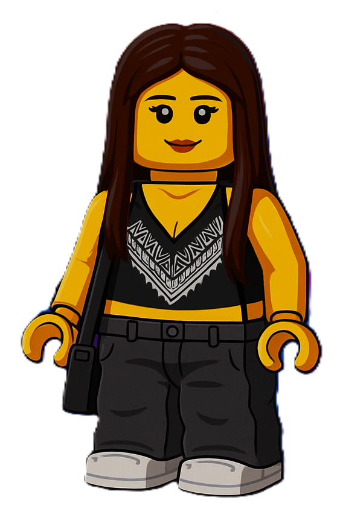

<!-- Diya Budhia - GitHub Profile README -->

  <!-- NAME: purple + distinct font look (system fallbacks so it renders on GitHub) -->

  <!-- TYPING EFFECT (SVG) -->

  

    Aspiring Software Engineer | Final-Year BSc Computer Science Student at the University of Pretoria 
    Focused on AI, Full-Stack Development, and UX-Driven Design.
  

---

  
  
&nbsp;

  <table>
    <tr>
      <td align="center" width="250">
        
      </td>
      <td align="left" style="vertical-align: top; padding-left: 20px; line-height: 1.6;">
        🎓 Final-year <b>BSc Computer Science</b> student at the <b>University of Pretoria</b> 
        💡 Passionate about <b>AI</b>, <b>Full-Stack Development</b>, and <b>UX-Driven Design</b> 
        🧠 Skilled in multiple programming languages including <b>Python</b>, <b>Java</b>, and <b>C++</b> 
        🧩 Strong foundation in <b>data structures</b>, <b>algorithms</b>, and <b>object-oriented programming</b> 
        🧱 Enjoy solving real-world problems through efficient, creative, and well-designed software 
        💻 Advocate for clean, scalable code and user-centered digital experiences 
        🌍 Co-founder of <b>Street Smartz</b>, an ongoing, mobile app improving youth safety and mentorship access in South Africa 
        🪶 Outside of tech, I enjoy <b>drumming</b>, <b>creative arts</b>, <b>music</b>, and <b>hiking</b>
      </td>
    </tr>
  </table>

---

<!-- CENTERED TECH STACK -->

&nbsp;

<table>
  <tr>
    <td align="center" width="110">
       Python
    </td>
    <td align="center" width="110">
       Java
    </td>
    <td align="center" width="110">
       C++
    </td>
    <td align="center" width="110">
       JavaScript
    </td>
    <td align="center" width="110">
       TypeScript
    </td>
  </tr>
  <tr>
    <td align="center" width="110">
       React
    </td>
    <td align="center" width="110">
       Node.js
    </td>
    <td align="center" width="110">
       Express
    </td>
    <td align="center" width="110">
       MongoDB
    </td>
    <td align="center" width="110">
       MySQL
    </td>
  </tr>
  <tr>
    <td align="center" width="110">
       Git
    </td>
    <td align="center" width="110">
       HTML5
    </td>
    <td align="center" width="110">
       CSS3
    </td>
    <td align="center" width="110">
       Figma
    </td>
    <td align="center" width="110">
       Canva
    </td>
  </tr>
</table>

---

<picture>
  <source media="(prefers-color-scheme: dark)" srcset="https://raw.githubusercontent.com/diyaxbudhia/diyaxbudhia/output/github-contribution-grid-snake-dark.svg">
  
</picture>

    

  

  

  

---

&nbsp;

  
  
  
    
  <!-- CV BUTTON -->
  

---

  

&nbsp;

- **Street Smartz (2025–present)**: Co-Founder & Developer  
  A mobile app designed to empower South African youth with local safety alerts and mentorship opportunities.  
- **Academic Mentor (University of Pretoria, 2024)**: Assisted 30+ students in mastering computational logic and coding best practices.  
- **Vodacom Code for a Girl Bootcamp**: Built responsive web pages using HTML and CSS, promoting women in tech.

---

  

&nbsp;

- **Top 5:** Entelect University Cup Hackathon 2025  
- **Academic Full Colours Award:** Consistent top-tier academic performance  

---

  
    © 2025 Diya Budhia — Designed with precision and purpose  
   
  
    Code. Debug. Create. Repeat.
  

